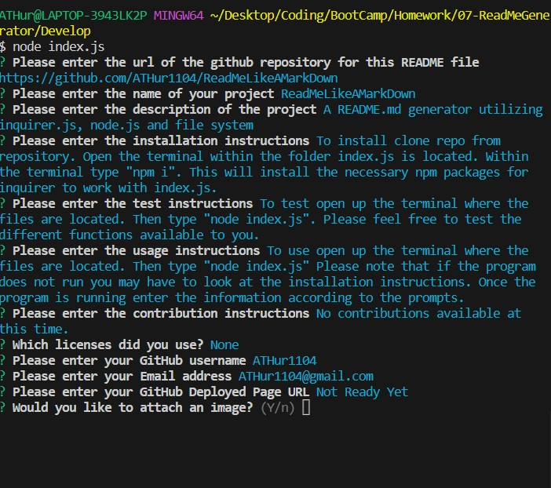

# ReadMeLikeAMarkDown
    
    
## Description
A README.md generator utilizing inquirer.js, node.js and file system
        

## Table of Contents
- [Installation](#installation)
- [Usage](#usage)
- [Images](#images)

- [Technology](#technology)

- [License](#license)

- [Questions](#questions)

    
## Installation
To install clone repo from repository. Open the terminal within the folder index.js is located. Within the terminal type "npm i". This will install the necessary npm packages for inquirer to work with index.js.
        

## Usage
To use open up the terminal where the files are located. Then type "node index.js" Please note that if the program does not run you may have to look at the installation instructions. Once the program is running enter the information according to the prompts.

    
## Images
README Generated:

App In Use:

## Technology
Javascript, Node.js, Inquirer.js and File Systems.

    

    
## License(s)
ISC License(ISC)
()
https://opensource.org/licenses/ISC

  
    
## Questions
Email: ATHur1104@gmail.com
        
    
GitHub: [GitHub](https://github.com/ATHur1104)
        
    
GitHub Repo: [GitHub repository](https://github.com/ATHur1104/ReadMeLikeAMarkDown)
        
  

